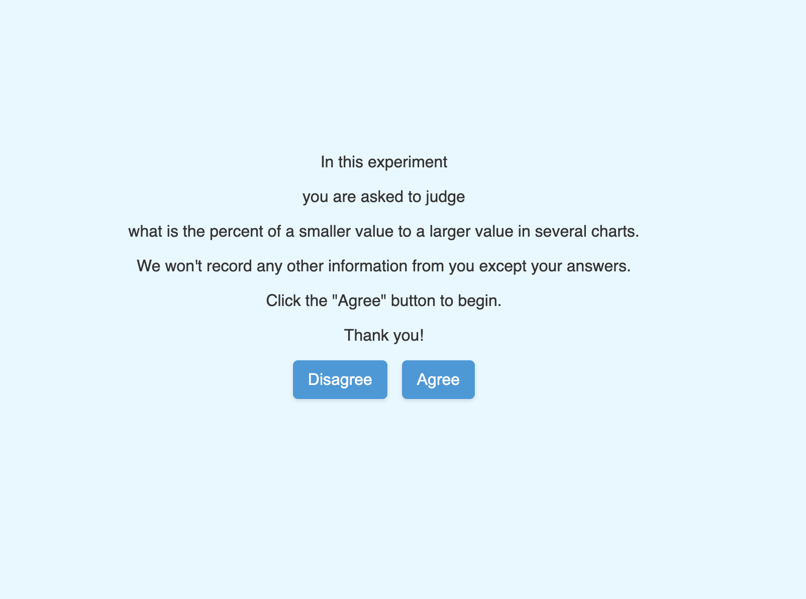
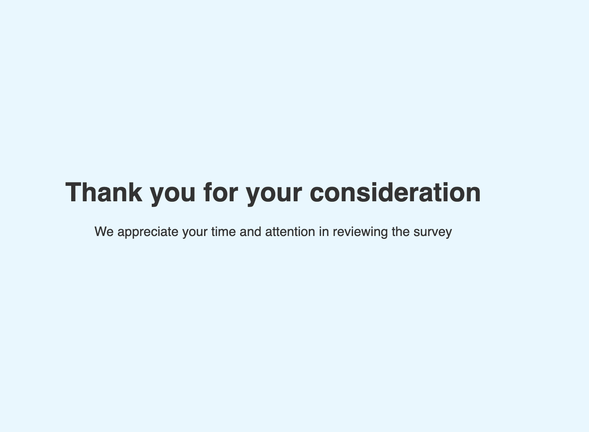
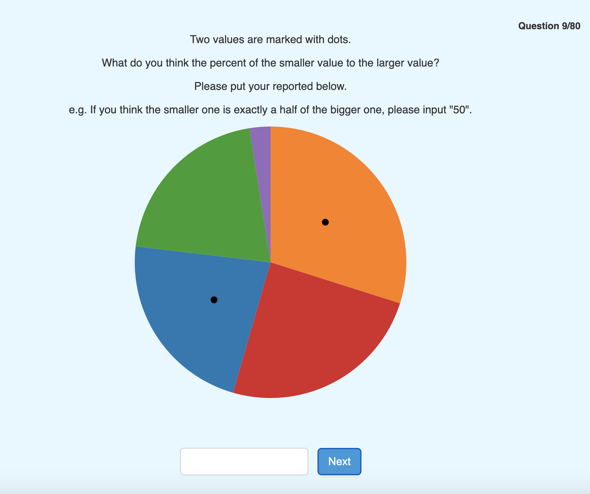
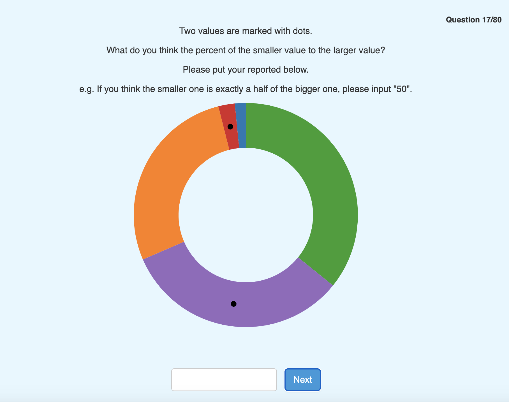
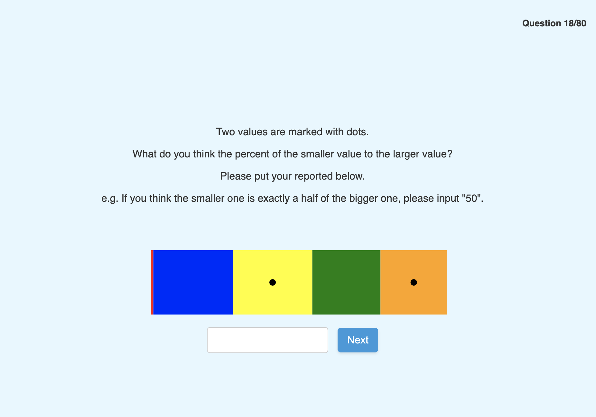
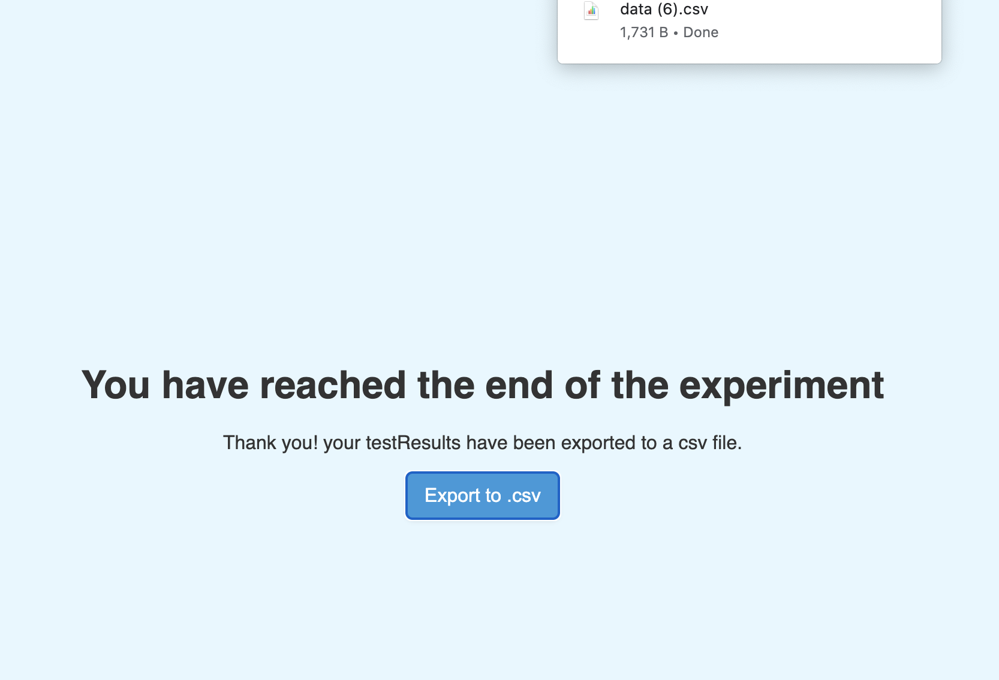
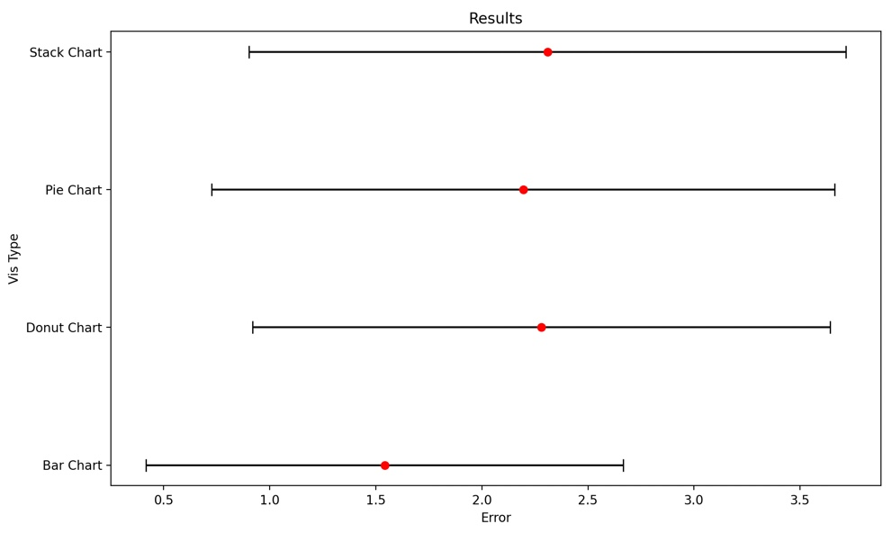

Assignment 3 - Replicating a Classic Experiment  
===
Team Members : Joselin Barbosa and Abigail Boafo

# Description of Study
In our study, we conducted a controlled experiment with four types of graphs, each marked with two dots, and participants were tasked with judging the percentage of a smaller value to a larger one in 80 questions. Through a text box, participants submitted their reported percentages based on the marked dots. The aim was to assess perceptual accuracy across various visualizations, drawing inspiration from Cleveland and McGill's 1984 experiment. The project involved generating random data points, implementing error calculation using the log-base-2 formula, and running the experiment with at least 10 participants. The visualizations, including bar charts, pie charts, and stacked-bar charts, were designed following Cleveland and McGill's style, with emphasis on controlled elements and spacing. We hypothesized that the donut chart would exhibit superior performance among the visualizations tested. However, the experiment results diverged from our initial expectations, highlighting the importance of empirical testing in evaluating the effectiveness of different chart types.

# Results

The sidebar chart results were the most effective, with the pie chart closely trailing behind. The donut chart followed and the stacked bar chart took the last position. Interestingly, our initial expectations were high for the donut chart, as we anticipated it to outperform the others based off its unique design. 

# Technical Achievements
In our technical achievements, we implemented a modular chart generation system using D3.js, allowing for dynamic updates to chart types based on a predefined sequence. The regenerateGraph() function facilitates a seamless transition between different chart types, enhancing the scalability and adaptability of the experiment. We also alow for user interaction through event listeners on the "Agree" and "Disagree" buttons, redirecting users to subsequent pages while recording their choices. The CSV data, containing user inputs and corresponding correct results, is efficiently generated and downloaded, providing a structured format for analysis. Lastly, we display the current question number out of the total questions, enhancing user guidance and experience.

# Design Acheivements
For our design achievements we added a background color to all pages 
used diffrent font sizes for each page and designed the buttons to contributes to the modern aesthetic of our study. The button design features a pleasing color scheme, rounded corners, and subtle box shadows for an engaging and intuitive user interaction. Additionally, each page has unique styles, such as a counter for question number and specific chart presentation on the "Next Page." These design elements collectively result in a well-balanced and visually appealing interface that complements the study's theme while prioritizing user experience.
