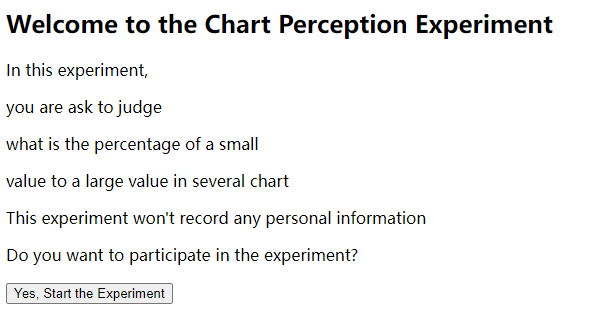
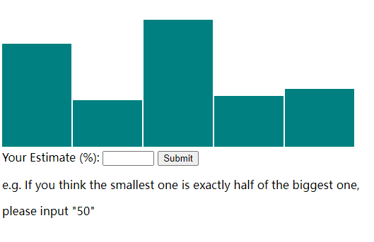
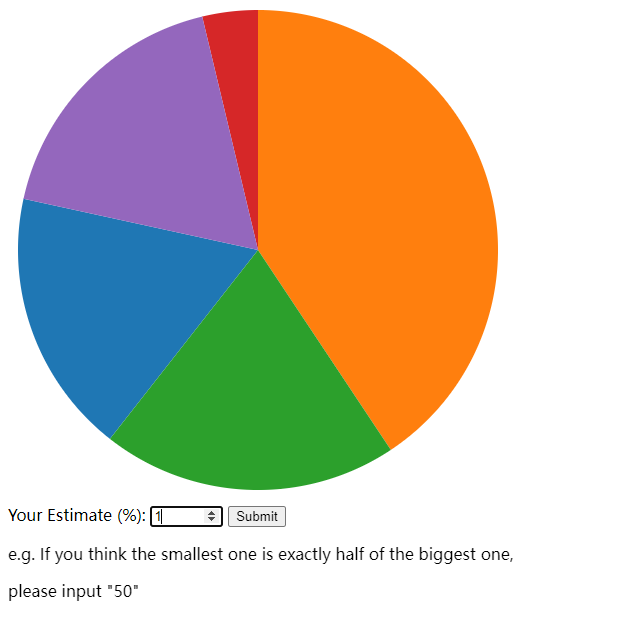
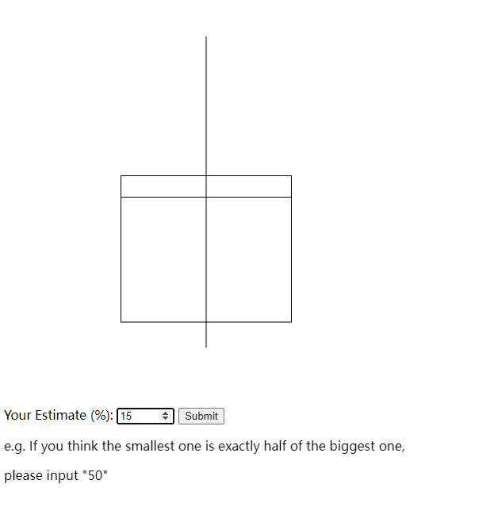
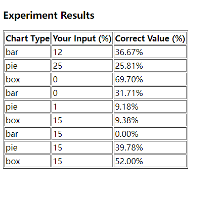

# Dynamic Chart Experiment Web Application

This web application is designed to conduct an interactive experiment where participants estimate values from different types of charts. The application cycles through a predefined sequence of chart types, displays each chart with randomly generated data, and asks the user to input their estimate of a specific value depicted by the chart. After completing the sequence of charts, the application presents the user with their estimates compared to the correct values.

## Features

- **Dynamic Chart Generation**: Uses D3.js to generate three types of charts (Bar, Pie, and Box Plot) with randomly generated data for each trial.
- **User Interaction**: Allows users to input their estimates for each chart and saves these inputs for later comparison with correct values.
- **Results Display**: After all trials, displays a summary of the user's estimates alongside the correct values for each chart type.

## How to Use

1. **Start the Experiment**: When the webpage loads, the user will see a start button. Clicking this button will hide the introduction and display the first chart.
2. **Enter Estimates**: For each displayed chart, the user should enter their estimate of the specified value into the form and submit it. The application will log the estimate for demonstration purposes and then move on to the next chart.
3. **View Results**: After completing all chart trials, the application will display the user's estimates and the correct values for each chart, allowing for comparison and analysis.

## Implementation Details

### Event Listeners

- The application sets up event listeners for the DOM content to be loaded, for the start button to begin the experiment, and for the form submission to handle user estimates.

### Chart Sequence and Data Generation

- A predefined sequence of chart types is cycled through for the experiment.
- Random data is generated for each chart display, and the correct values are calculated and stored for comparison with user inputs.

### Chart Display Functions

- Separate functions are implemented for displaying each type of chart using D3.js. These functions handle the specifics of drawing bar charts, pie charts, and box plots.
- The display function for each chart type is called based on the current position in the chart sequence.
  
  
  
  
### Results Calculation and Display

- After the last trial, the application calculates the correct values based on the generated data and compares them with the user's estimates.
- The results are then displayed in a table format, showing the chart type, user input, and correct value for each trial.
  
## Technologies Used

- **HTML/CSS**: For structuring and styling the web application.
- **JavaScript**: For implementing the interactive functionality and chart generation.
- **D3.js**: A JavaScript library used for producing dynamic, interactive data visualizations in web browsers.

## Setup
Use this link
https://jinjiaou.github.io/a3-Experiment/
