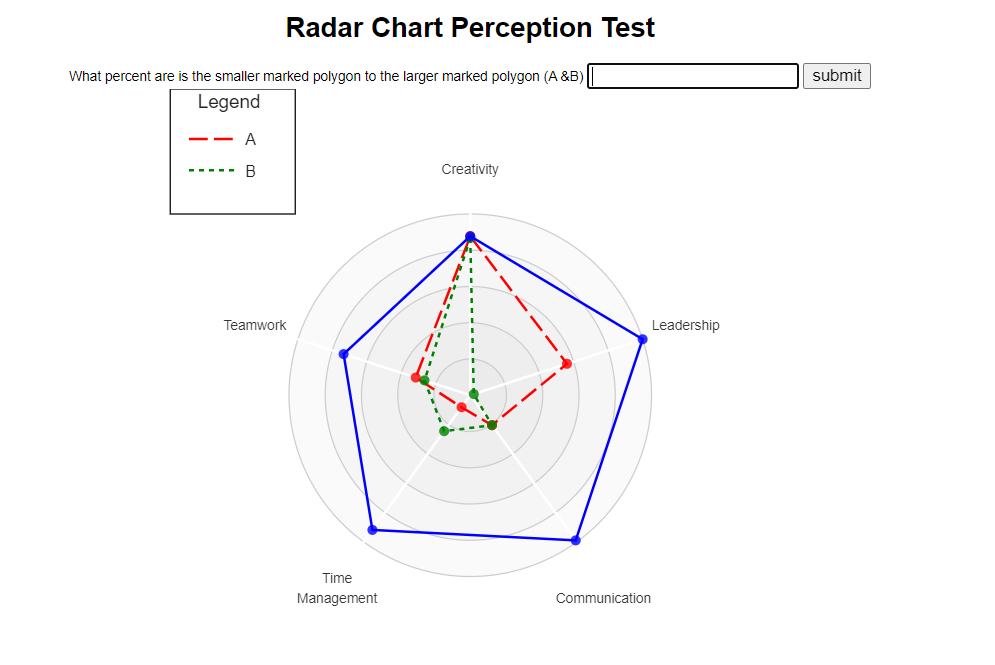
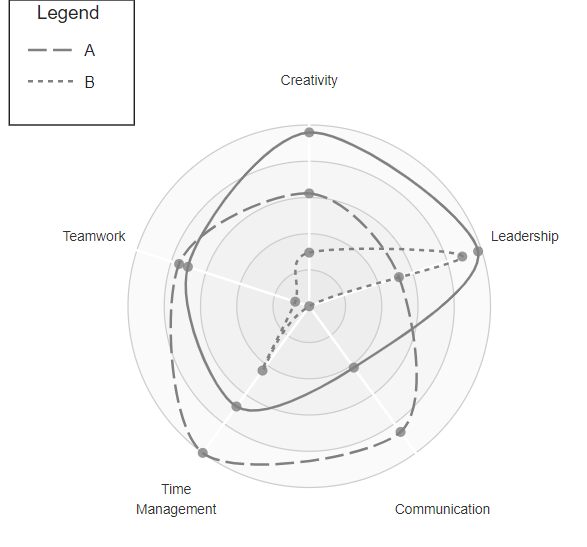
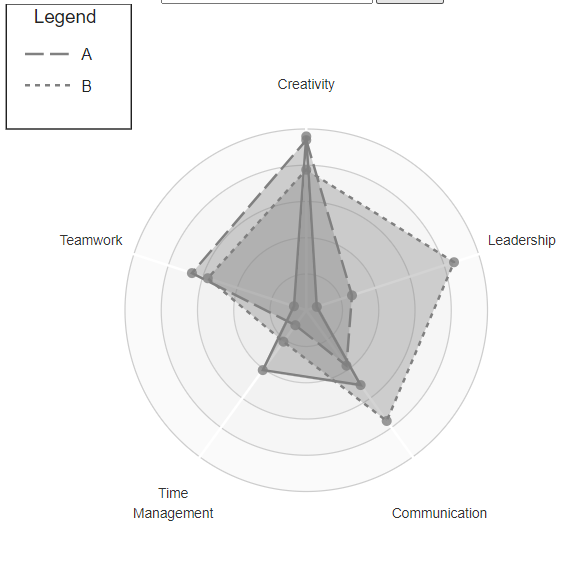
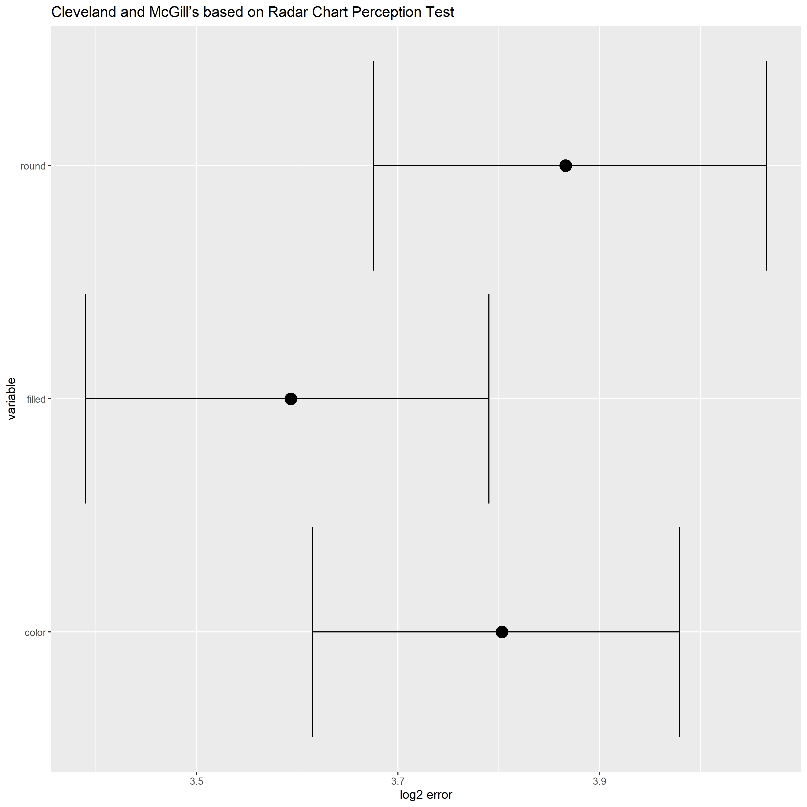

Assignment 3 - Replicating a Classic Experiment  
===

- [link to site](https://kylieflerlage.github.io/a3-Experiment/)

# Description of Study
This study intended to compare different features a radar chart may contain to see which are most impactful in correctly perceiving the graph. The three variables were color vs. greyscale, rounded vs. angular edges, and shapes with a transparent fill vs no fill at all. Only one variable was presented at a time. The variable tested was randomly chosen, submission was stored in an array. Upon completion of the experiment a csv file of results was downloaded automatically. These csv files were compiled in one master csv.

Compare Color

Compare Rounded Shapes

Compare Filled Shapes

Results 

As seen by the box plots, all variables created a larger error than the Cleveland & McGill tests. 
 Additionally, the errors were close, with only about a 0.6 difference in the minimum and maximum bootstrapped samples. However, it can be show that the filled variable has the lowest mean error, followed by color and then rounded edges.

## References
[chart Creation](https://gist.github.com/nbremer/21746a9668ffdf6d8242#file-radarchart-js)
I removed anything that could count as an untested variable, and added modification features to tested variables.

[write to file](https://codepen.io/jayeshdhage/pen/bGBPMxx)

[ggplot info](https://ggplot2tutor.com/tutorials/summary_statistics)

# Design
I have a legend that updates when the color variable is being tested to easily show marks