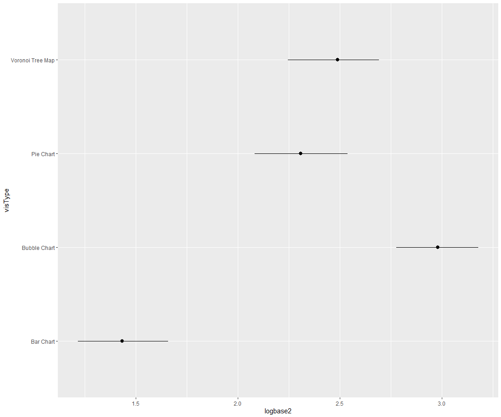
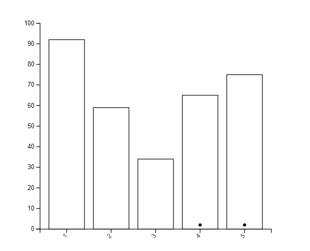
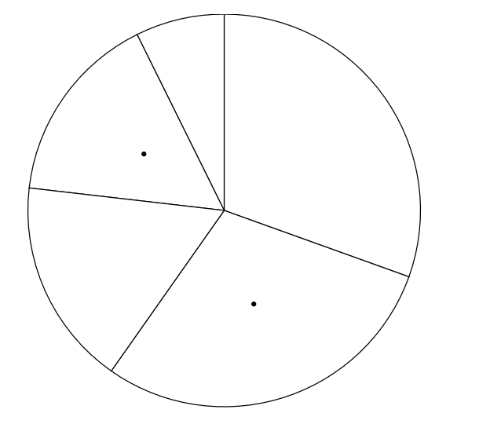
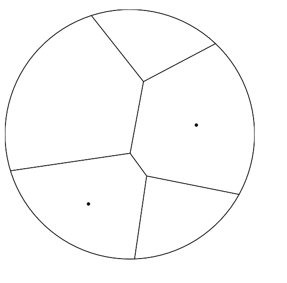
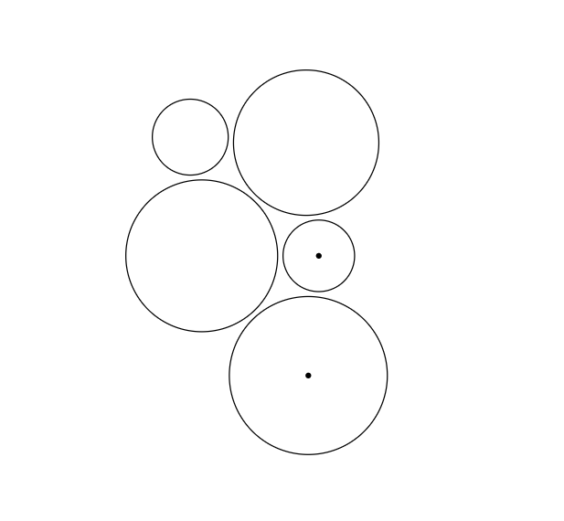

Assignment 3 - Replicating a Classic Experiment  
===
Group Members: Ryan Dillon, Ally Giovenco, Pegah Emdad

GitHub Pages Link
---
https://amgiovenco.github.io/a3-Experiment/

Experiment Summary
===
Log2Error & 95% Confidence Interval Chart

The bar chart performed the best, followed by the pie chart, then the voronoi tree map, and finally the bubble chart.

Calculations for mean log2error for each visualization type, standard deviation, and confidence interval can be seen in /spreadsheets/data_error_graph.xlsx. R code for the above chart can be found in rConfidenceInterval.r.

## Bar Chart
Example Visualization:

The average log2error of the bar chart trials was ~1.7468.

## Pie Chart
Example Visualization:

The average log2error of the pie chart trials was ~2.5408.

## Voronoi Tree Map
Example Visualization:

The average log2error of the voronoi tree map trials was ~2.6697.

## Bubble Chart
Example Visualization:

The average log2error of the bubble chart trials was ~3.0739.

Technical/Design Achievements
---
Technical:
- We created a Voronoi Tree Map as one of our visualizations, which took a lot of research and trial & error to get right. We ended up trying two different methods, the first of which can be seen in /chart-examples/voronoiTreeMap.html. This method dealt with delauney triangulations and used d3.delauney and d3.voronoi. The second method, which we used in the index.html file used a hierarchy similar to the bubble chart and then used a plug-in for d3.voronoiTreemap to create the voronoi nodes.
- At the end of each experiment trial run, the data is entered into a CSV file automatically and downloaded with the push of a button

Design:
- The input area and submit buttons are bounded by a dark black line to draw the user's attention to them
- There are three different screens, so the user is transitioned in to the experiment with a welcome and explanation screen, and is notified that they are finished with a thank you screen
- There is an ongoing question counter so the user knows exactly how far they are in the experiment

Resources
---
Download CSV Files: https://www.tutorialspoint.com/how-to-create-and-download-csv-file-in-javascript

Creating a Bubble Chart in D3: https://medium.com/@jhren/d3-data-visualization-in-javascript-use-d3-js-to-create-a-bubble-chart-3fba181faacd 

Creating a Voronoi Tree Map in D3: https://observablehq.com/@will-r-chase/voronoi-treemap

Voronoi Tree Map: https://www.react-graph-gallery.com/voronoi 
