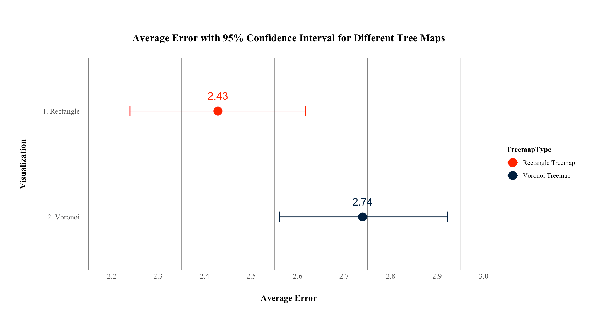
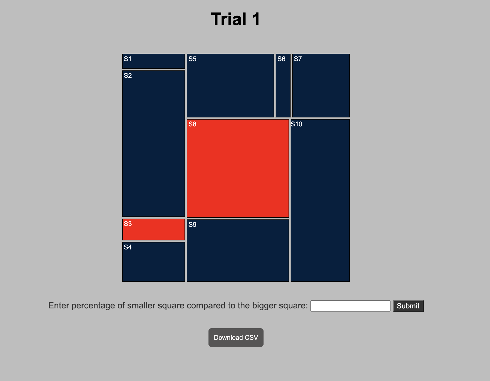
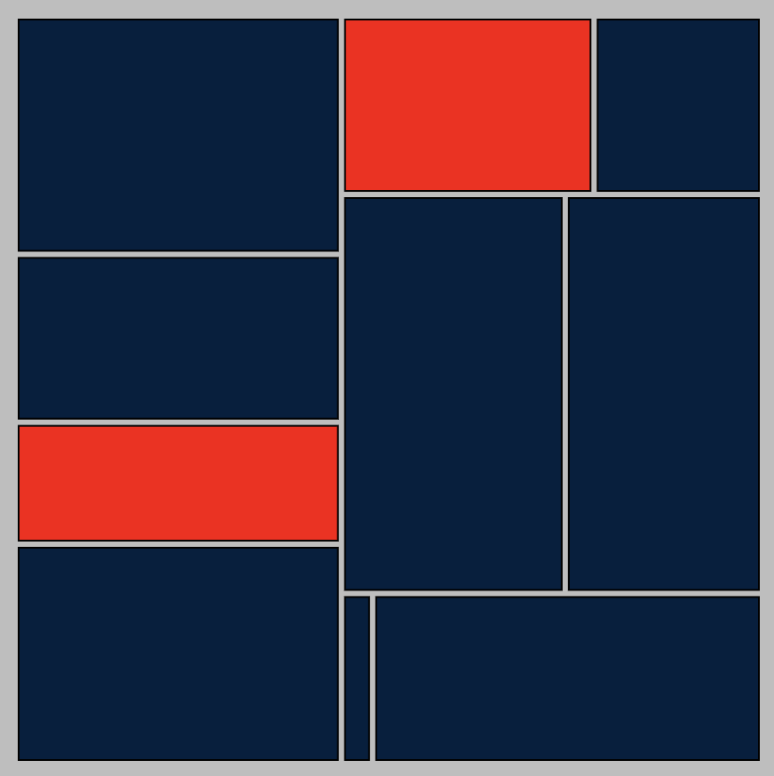
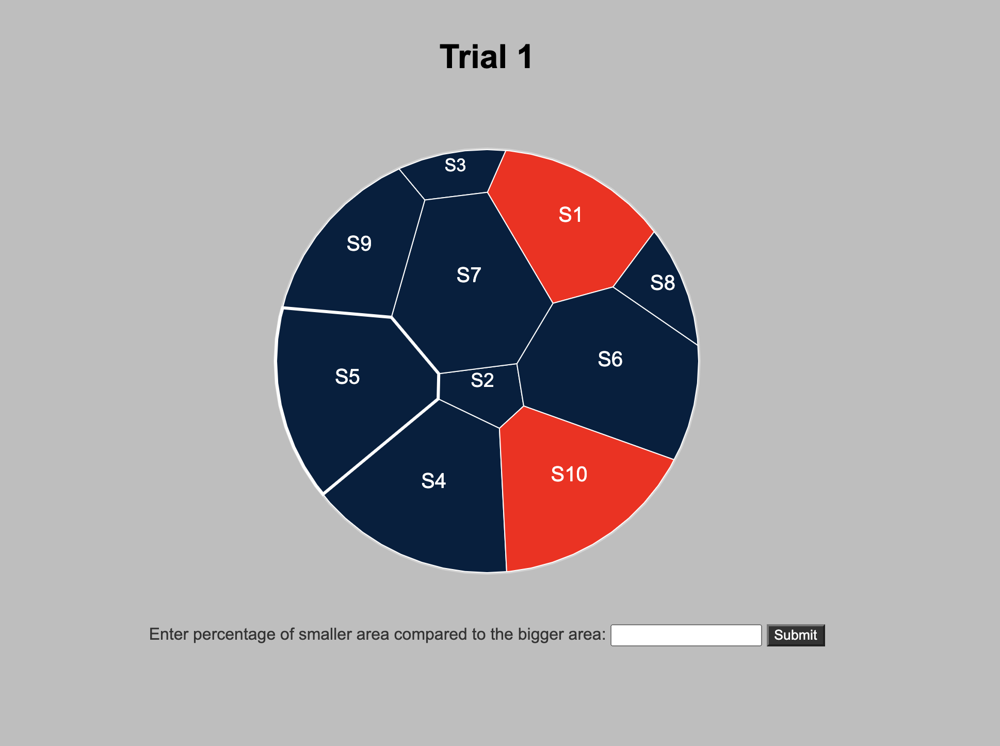
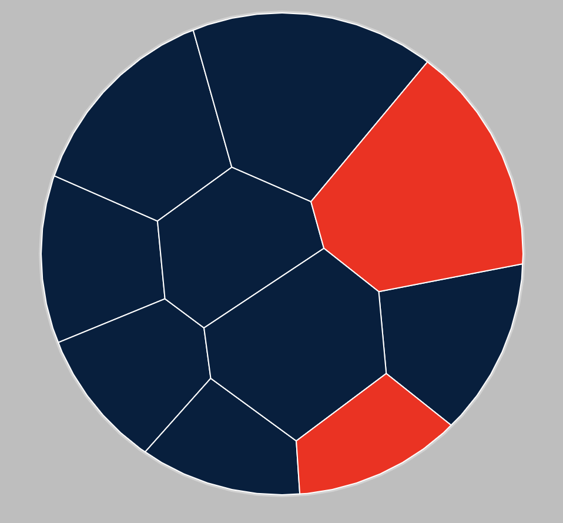
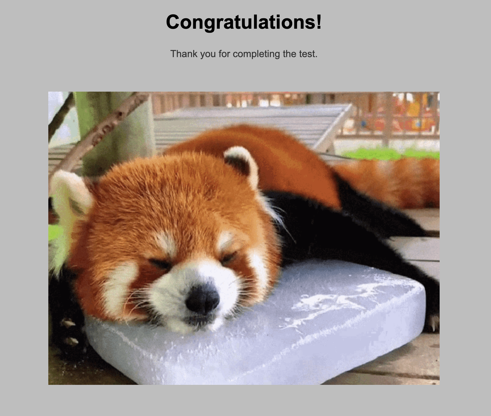

# Treemap Experiment - Rectangluar vs Voronoi

For our experiment we are testing if the shapes of the Treemaps effect readability and perception. For example, how does shapes effect the judgement of the size of a section in comparison to other sections. In our experiment we tested to different styles of treemaps, Rectangular and Voronoi.

Each trial in the experiment generates a set of 10 random data points (S1-S10) with values from 5-100. Then two of those data points are marked red. Each trial is then recorded after a response from the user. At the end of each experiment (rectangular and voronoi) a set of data will be printed out as a csv. Displaying the trial number, the true percentage, your answer, and the error.

We repeated this experiment with 10 individuals, with 20 trials for each the rectangular and the voronoi treemap. We found that it generally easier to compare sizes on the rectangular treemap as opposed to the voronoi treemap. We displayed those results using R + ggplot2, using the average error of each experiment and a bootstrapped 95% interval. Refer to image below.

Results:

Our Experiment:

Design Achievement:
- We designed the colors to be dark blue and the highlighted colors to be red for readability. As it is easier to see and tell those colors apart.
- Those colors are consistent throughout our experiment and results as shown in the error plot.
- We have added an introduction page which introduces the experiment, how the trials are presented, and how the experiment works. 
- Displays other metrics other than "true percentage" and "response" including the trial number and error.
- We fixed the trial results to 2 decimal places for readability. 
- This helps give the us and the subjects a better understanding of how they performed.
- After a long experiment we wanted to add something to cheer them up, hence why there is a congrats page. The page shows them that they have completed the experiment and a gif of a red panda for comfort. 
- We have a styles.css which allows us customize the style of the experiment and make it more professional.
- We centered the everything on the page. Set fonts to Times New Roman for readability and professionalism.
- We changed the random number generation from 1-100 to 5-100, as from 1-100 some areas become too small to see, so we decided that to improve readability we can generate numbers from 5-100 without skewing the data. 
- Implemented legends on the ggplot for better readability

Technical Achievements:
- Implemented a dynamic circular voronoi treemap.
- Plotted Results through a R + ggplot query
- Used a combination of CSS, JS, and HTML to format and refactor the code, rather than having everything in the HTML. This makes it easier to make changes and adjustments later on.
- Made different pages for rectangular treemap and voronoi treemap trials for better organization and navigation.
- Included a helper.js with all the common functions between the two experiments, again for organization and refactoring purposes. 
- Implemented dynamic randomization methods like: random csv generation, random json generation that worked for each of the experiments, rectangular and voronoi treemaps, respectively.
- Implemented randomization of selection of the sections for more randomize data. 
- Implemented dynamic labels (text) generation, that would change its positioning(on both) and size(only on voronoi) from trial to trial. 
- Implemented the formula into the experiment to solve and print error for every trial. 
- Implemented an algorithm to save and keep track of the results of each trial, to then print them at the end of each experiment.
- Implemented formatting and display boxes in css to keep everything in place and centered, even when the screen are different sizes.
- Implemented a download csv button which allows the user to download the current trial's csv (only for rectangular)
- Attempted to implement the same download feature for voronoi tree map. 

