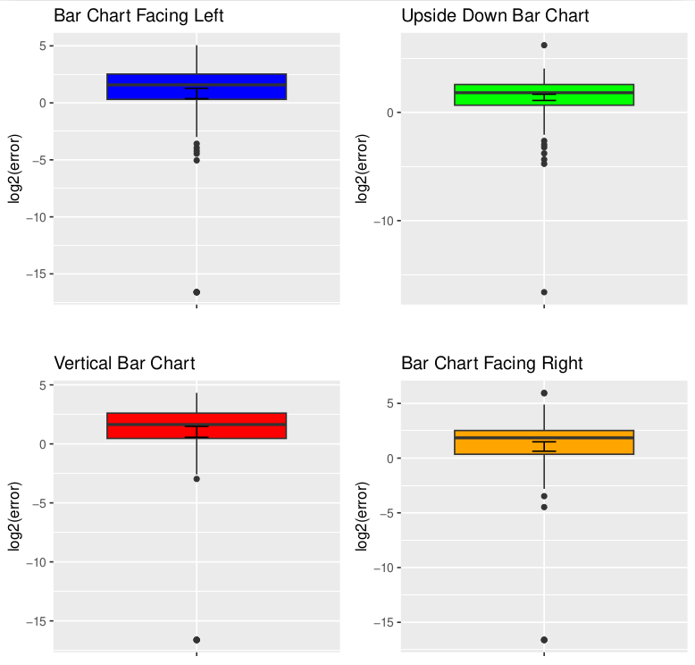
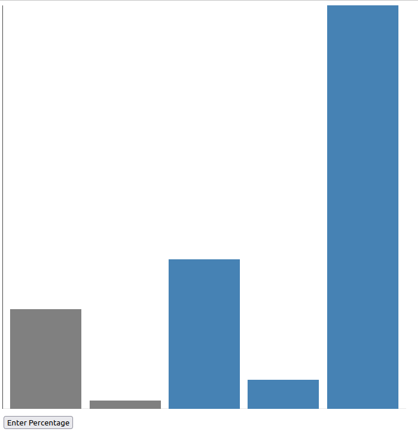
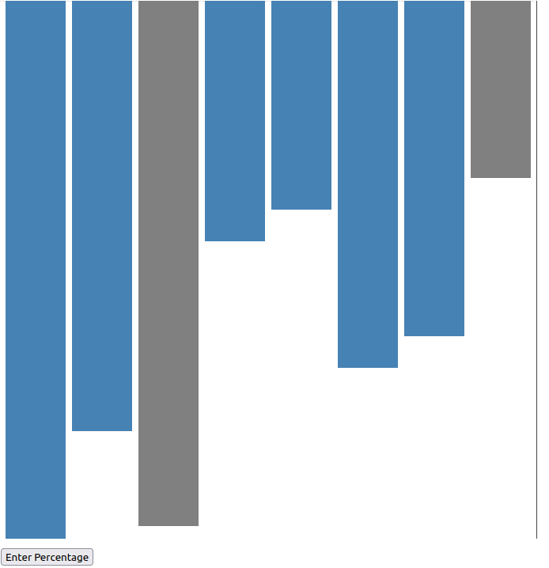
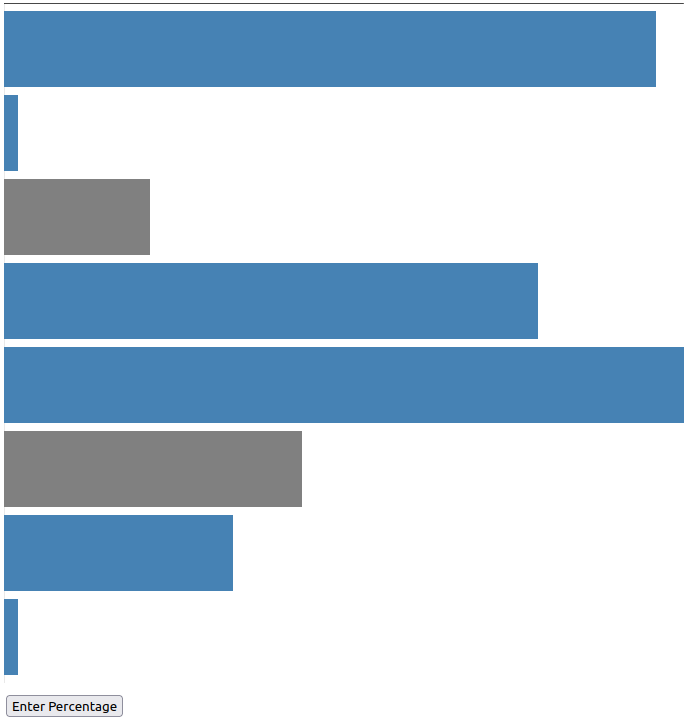

Assignment 3 - Replicating a Classic Experiment   
Survey Link and Sources Used/Disclaimer===================================================================================== 
Site Link: https://omrigreen.github.io/a3/a3.html 

Sources Used/Disclaimer:  
I have tried using ChatGPT as an AI "copilot" to help explain bugs and the usage of some tools in d3 and R. I am unsure of how to credit it considering it is a "Webscraper".  
For the Bar chart I have used the following link as a scaffold: https://d3-graph-gallery.com/graph/barplot_basic.html.  
To generate each graph I also used the transform function which I used the documentation from the link: https://www.tutorialspoint.com/d3js/d3js_svg_transformation.html.  
For the R code I have used the code from assignment 2 with the following source: https://www.youtube.com/watch?v=Dh7P5ExsYCg&t=339s in addition to this: https://d3-graph-gallery.com/graph/boxplot_basic.html.  
For data generation and graph selection I used the Math.random() function which I learned the usage from: https://www.w3schools.com/JS/js_random.asp. 

Graph and Analysis================================================================== 

Comparision Graph: 
  

Vertical Bar Graph: 
  

Upside Down Bar Graph: 
  

Bar Graph Facing Right: 
  

Bar Graph Facing Left:  
  

Analysis: 

The initial hypothesis, that "Vertical Bar Graphs will be the most easy to use, Bar Graphs facing left and right will be equivalent to eachother but worse than a Vertical Bar Graph, and that Upside Down Bar Graphs will be the most difficult to read", seems to be mostly incorrect. The Vertical Bar Graph and both the Left and Right Bar Graphs have the same average score of about log2(error) = 1, with similar outliers of around -16 which is not infinity only due to the fact that 0.00001 was added to the log2(error) because infinity cannot be graphed. However, with the Upside down graph the theory was correct, the average score was about 2 with the outlier being similar to the other 3 graphs. Based on the information given the hypothesis is mostly incorrect, the Vertical Bar Graph, the Bar Graph facing Right and the Bar Graph facing Left are all roughly equivalent. However, it is correct in regards to the Upside Down Bar Graph which has about 4 times more error than the other graphs. 

Achievements========================================================================================================================= 

Technical Achievements: 
    Survey: 
        Every single graph generated is unique, made by a random number generator for data point having a value ranging from 1-100 and generating between 5-10 data points each, in each graph 2 bars are made gray to indicate that they are the ones to compare. Additionally there are 4 different types of bar graphs used in the experiment, Vertical Bar Chart, Upside Down Bar Chart, Bar Chart Facing Right, and Bar Chart Facing Left. The choice between which chart to display is random, however, they are all limited to 20 attempts each per survey allowing for a total of 80 datapoints. Additionally, the data is collected through a button where if pressed a prompt will appear asking for how big the smaller marked bar is compared to the smaller one in a percentage (i.e. 100% = 100). After all 80 graphs are marked a CSV will download where every each column is a type of graph and the data in the columns is the log2(error) of the data. 
    R-Graph: 
        Seperated the data into 4 different box and whisker plots, each one has a custom title which was changed from the placeholder put into the csv. Additionally every one has its y label marked as log2(error), and lastly each one has a different color. 
Design Achievements: 
    Survey: 
        The unmarked and marked bars are strikingly different, i.e. unmarked ones are blue while the marked ones are gray making it obvious which one is which. Additionally they are spaced apart making them easy to read. The graph is also clean with a marker of the "starting" axis and no other labels. The button was also moved to the bottom left and is not distracting from the graph for easier comparison. 
    R-Graph: 
        Each data from the is color coded, have different titles, and are in different graphs to avoid any confusion between them. Additionally they are labeled clearly and the titles easily show what bar graph they are all talking about.

