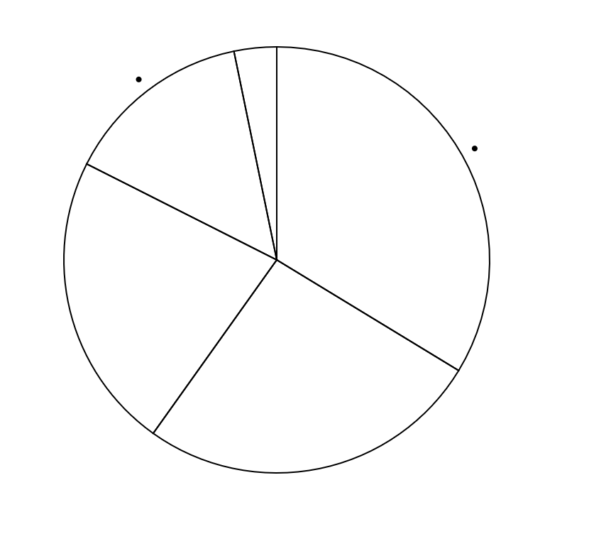
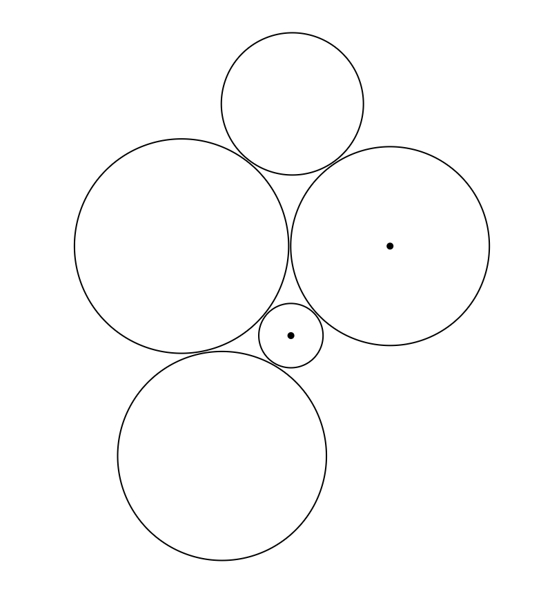
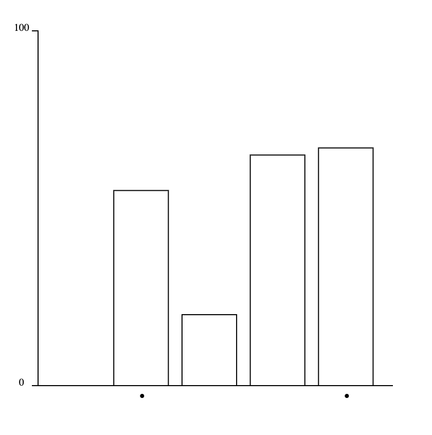
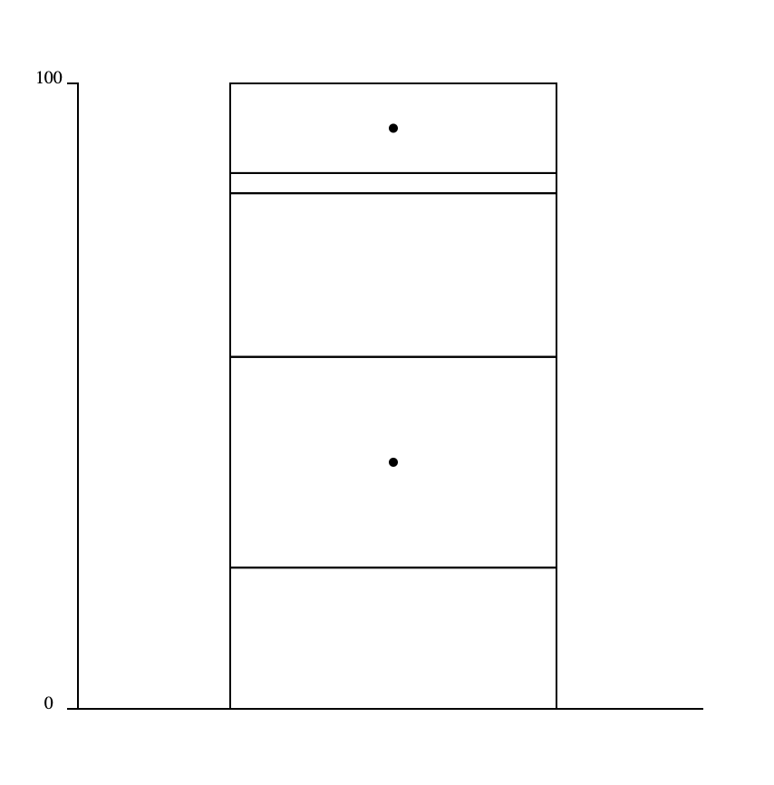

--We could not get our experiment to work when hosted on github pages or other hosting solutions, so we had to run the experiment locally following reVisit's instructions. Github pages does not work well with reVisit's javascript components

Our group replicated the Cleveland-Mcgil experiment by generating 10 random datasets for each of our visualizations. We used Bubble Charts, Pie Charts, Bar Charts, and Stacked Bar Charts. We built our experiment with reVisit, and generated our random data by using a script to modify the original cleveland
config json to generate 10 arrays of 5 random values (0-100) for each chart type, and randomly select two indeces from the array to be compared in the experiment. 
Our charts are react components that randomly select one of its corresponding 10 generated arrays to use for the experiment. 

Our group hypothesized that the pie charts would have the lowest difference beetween participant response and the actual correct answer. 

Examples of our charts look like this:

Because our data was randomly generated, the correct answers to our trials were not usually numbers that would intuitively be guessed by participants. For example, a chart may have the correct answer of 48, whereas many participants would logically answer 50. 

Of all of our charts, we found that participants were able to most accurately guess closest to the actual answer in our stacked bar charts. This did not support our hypothesis of pie charts performing the best. Our bar charts had the lowest average absolute difference between the response and correct answer, as well as the lowest log base 2 error of all charts.

Technical achievements:
-Created react components that dynamically scale with our data generation
-Created 4 data visualization types

Design achievements:
-Same color hex codes throughout all visualizations between platforms

