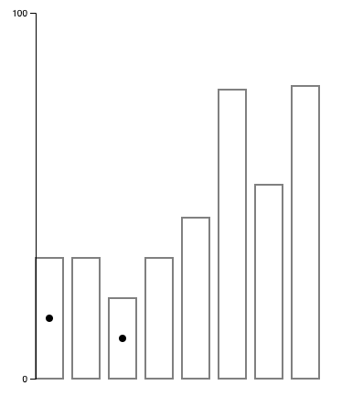
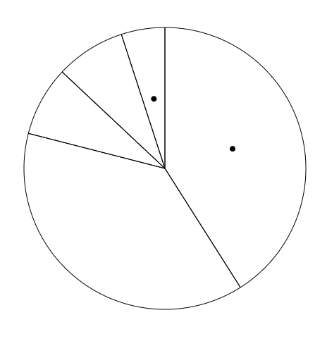
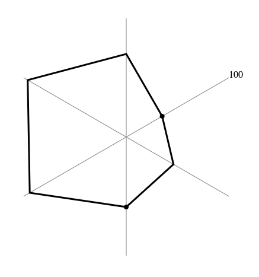
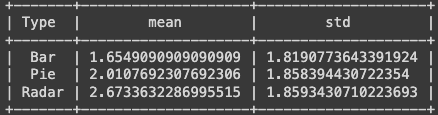
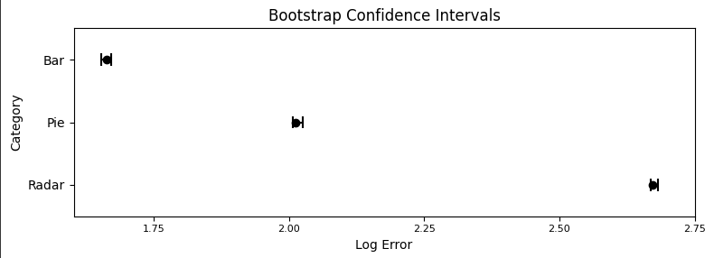
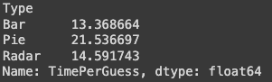
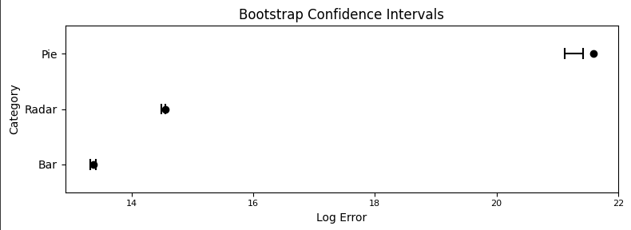
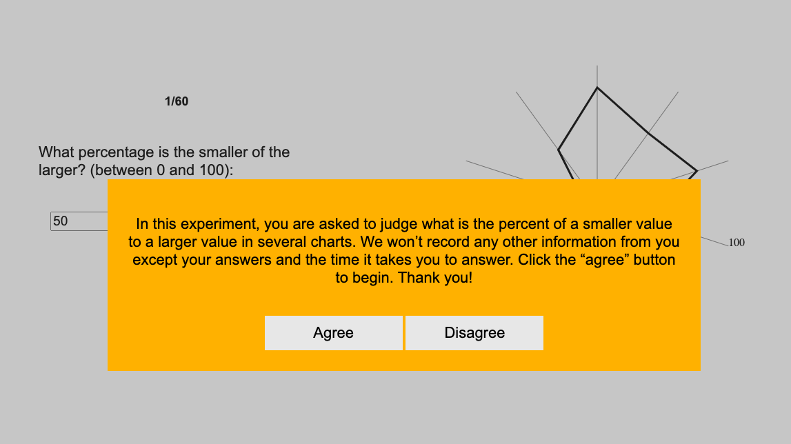

# Important notes:

## Python code
It says I (matt) committed the python notebook but that work goes to Kathleen Wang

## Link to google sheet export 

https://docs.google.com/spreadsheets/d/1YLLFVs2y0ahIyru7jkPcVm1RXUPCGGYrQGN_UHzxJ40/edit#gid=0

## Link to expirement 
https://mattkiszla.github.io/a3-Experiment/

# Description:

For our expirement we tested people's performance on three charts(Bar, Pie, and a Radar Chart). The performance was mainly evaluated based on accuracy. However, we also recorded time it took participants to submit answers. We created a UI for the epirement and used a Google Script to send that data automatically to a google sheet. We got over 200 responses for each chart type. Overall in the expirement it seemed the charts in terms of accuracy were in the following order 1. Bar Chart , 2. Pie Chart, 3. Radar Chart. For time it took the average time it took from least to greatest is as follows 1. Bar, 2. Radar, 3. Pie

# Chart Examples:

## Bar

## Pie

## Radar

# Results:

## Table for Average Error by Chart

## Chart with 95% bootstrap intervals

## Table with Time Averages by chart

Important note: these values are not the best representation of how long It took but does give a general idea about what charts people answer faster on. The reason for it not being the best representation is the data from the expirement was submitted after each guess and the time stamp of the submition was used to determine time it took to answer a question. However, internet issues could affect time. In addition we did remove some extreme outliers(ex: someone taking 70,000 seconds between answers) however there could still be some smaller outliers. 

## Chart for Time with 95% bootstrap intervals

# UI 

## Into screen

Disagree button would bring the user to an about:blank page removing them from the expirement.

## End screen

Exit button would bring the user to an about:blank page removing them from the expirement.

# Technical Acheivements 
- By following this tutorial https://github.com/levinunnink/html-form-to-google-sheet we were able to have our expirement automatically send data to a google sheet so data analysis could be easily done later on. This is an improvement over having to manually copy any data from an expirement after a user is done into a google or excel sheet and it means that someone can take this expirement from anywhere without the assistant of an expirement manager.
- We also developed a Radar chart which shows a greater knowledge of d3,html, and SVGs as you have to work with polygons and understand how to manipulate and rotate points to show up properly on a screen more then you do with simpler graph like a pie chart or bar chart.

# Design Acheivements

- Added a sliding bar to use to help select a number for the guess. However, a user could still enter a number if they wanted to
- Added a loading wheel that happens after each answer that allows the user to know when they can start to answer the next one
- developed a CSS file to better facilitate the UI design

# Sources:

- https://d3-graph-gallery.com/graph/barplot_basic.html for bar plot help
- https://academo.org/demos/rotation-about-point/ for helping rotating points for radar plot
- https://developer.mozilla.org/en-US/docs/Web/JavaScript/Reference/Global_Objects/Array/map
-https://developer.mozilla.org/en-US/docs/Web/JavaScript/Reference/Global_Objects/Array/join
-https://d3js.org/d3-shape/arc for pie chart
-https://d3js.org/d3-shape/pie for pie chart
-https://d3-graph-gallery.com/graph/pie_annotation.html for pie chart
-https://github.com/levinunnink/html-form-to-google-sheet for submitting data to a google sheet from html form
-https://stackoverflow.com/questions/59747313/how-can-i-plot-a-confidence-interval-in-python for the confidence interval in python
-https://pandas.pydata.org/docs/reference/api/pandas.DataFrame.transform.html
-https://www.statology.org/pandas-groupby-transform/ the last two for learning about transform, used it to get only results where people finished a majority of the expirement