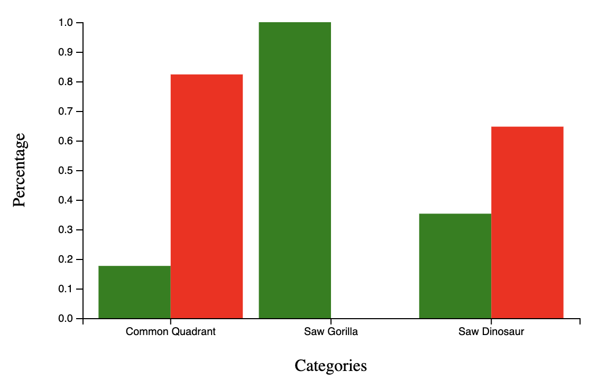
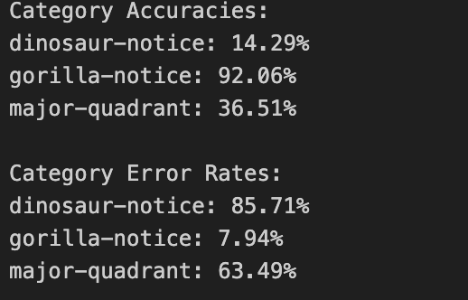

Assignment 3 - Replicating a Classic Experiment  
===

# Experiment:
This experiment is based off the paper "Jurassic Mark: Inattentional Bindness fo Datasaurus Reveals that Visualizations are Explored Not Seen". Specifically we attempted experiment 1: fiteration task. The idea behind this experiment is to focus on a specific mark (blue X's) in a sccaterplot while filtering out any other blue and green markers in the graph. Even within this experiment there are hidden images like a dinosaur which is tested to see if the particpant noticed it.

# Data:
The datasaurus graph was sourced from https://www.dropbox.com/sh/xaxpz3pm5r5awes/AADUbGVagF9i4RmM9JkPtviEa?dl=0. The data was translated to have a normal distribution, that is x and y means of 0 and x and y variance of 1. To limit the differences between the scatter point plots and the datasaurus graph, data for each scatter point plot was generated such that the graphs had the same number of points in each quadrant, the same mean*, and the same variance* as the datasaurus graph.

* Within a 0.02 margin of error from the datasaurus graph.

# Firebase/reVISit:
For storing data from reVISit, we implemented FireBase using the instructions on the website. We ran into a few issues with ReCaptcha and CORS that we had to troubleshoot in office hours, as well as some issues with creating the github page to host the study online. Through FireBase, we created a collection for our participant responses with each of the participant's responses being stored in a separate document identified by their unique participant ID. To export the data from FireBase, we implemented and utilized Rowy (a low-code backend for managing Firebase databases) to export the data to a CSV where it could be further analyzed. 

Due to needing to include the files from reVISit, the github page and associated reVISit code are in a separate repository, https://github.com/AndrewSalls/study-a3/. As part of the study, we implemented d3 scatter plots which render the data we generated, and transition between the plots on a timer.

# Testing:
The experiment was conducted in https://andrewsalls.github.io/study-a3/. We were able to get 22 particpants to take part during this experiment. 

# Visualizations:
The visuals we created for the study include:

Generating graphs in d3:

(the graph with the dinosaur)

# Results:
We calculated the accuracy of identifying the major quadrants and if the the graph outlined a dinosaur or a gorilla. We found that these were the results.

This graph is modified with the clean data to show the percentage of the right to wrong. The Gorilla was nnever seen which is good but seeing the dinosaur and the right wuadrant were difficult to spot.

Note: This percentage account for every participants even the ones who did not answer the questions. 

Based off these calculations it can be said that noticing the dinosaur did not work since it seem many people are were seeing the gorilla which was not even in the test. The gorilla question was to ask whether they paid attention to the changing scatter plots, as an indication of whether they actually saw the dinosaur or just assumed it was there. Also, the participants were not sucessful in identifying which quadrant has the most number of blue X's, so their visual perception could not keep up. There were too many moving parts.

Technical Achievements
- Generation of data for scatter plots that had the same number of points in each quadrant, the same mean, and the same variance as the datasaurus graph.
- Utilized reVISit infrastructure to test our visualizations (including troubleshooting for implementing reVISit with Professor Harrison [CORS, ReCaptcha, etc.])
- Utilized FireBase to store data and participant response from reVISit
- Utilized Rowy (low-code backend) to manage database and export Firebase data to CSV for analyzation

